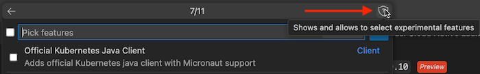

# Graal Development Kit for Micronaut Launcher

*** Technology Preview ***

[Graal Development Kit for Micronaut](https://graal.cloud/gdk/) (GDK) is a cloud-agnostic development framework, built on top of [Micronaut® framework](https://micronaut.io/). Using GDK you can write once and then run the same code on multiple cloud platforms.

This extension provides a wizard to easily create a new GDK project.

You are recommended to install the [Graal Development Kit for Micronaut Extension Pack](https://marketplace.visualstudio.com/items?itemName=oracle-labs-graalvm.graal-cloud-native-pack), which contains this extension and others, as the easiest way to get started.

## Create New Project Wizard
​
The wizard can generate different types of GDK and serverless applications. If building a GDK application, you can select the GDK features you want your project to include.

1. Go to **View**, **Command Palette**, search for "Graal Dev Kit", and invoke the **Graal Dev Kit: Create New Project** command.

    

2. Follow the command prompts to generate a new Maven or Gradle project. For example, to create a simple Java-based GDK application:
    - Select the Micronaut version
    - Select an Application type
    - Select a Java version to be used for the project
    - Provide a name for the project
    - Provide a base package
    - Pick the GDK services to be included in the project
    - Pick Features to be included in the project. For example, if the Database service was selected in the previous step, then pick the "Oracle Cloud Autonomous Transaction Processing (ATP)" feature which adds necessary dependencies to access an Oracle Autonomous Database.
       - Click the shield icon in this step to make also experimental (untested) features available for the project.
       
    - Select a build tool: Maven or Gradle
    - Select a unit test framework: JUnit, Spock, or Kotest
    - Select cloud providers to support: Oracle Cloud Infrastructure, Amazon Web Services, Google Cloud Platform; Note: you need to select OCI if you want OCI DevOps support

3. Finally, you are asked where to save your new project. You can then choose to open it in a new VS Code window or add it to a workspace in the current VS Code window.

You now have a new GDK application, complete with example code showing you how to start using [GDK](https://graal.cloud/gdk/).

## _Graal Development Kit for Micronaut_ Extension Pack
The _Graal Development Kit for Micronaut_ Launcher extension is part of the [Graal Development Kit for Micronaut Extension Pack](https://marketplace.visualstudio.com/items?itemName=oracle-labs-graalvm.graal-cloud-native-pack) which is the recommended way to get started. The extension pack also provides support for:
1. Oracle Cloud Infrastructure DevOps integration to provision build pipelines for GDK or Micronaut projects. GraalVM Native Image builds are provisioned automatically.
2. Micronaut development support including the Micronaut project wizard, REST Explorer, code completion, database drivers for Oracle DB and MySQL databases, and much more.

## Provide Feedback or Seek Help

* [Request a feature](https://github.com/oracle/gdk-vscode-extensions/issues/new?labels=enhancement)
* [File a bug](https://github.com/oracle/gdk-vscode-extensions/issues/new?labels=bug)

### Privacy Policy

Read the [Oracle Privacy Policy](https://www.oracle.com/legal/privacy/privacy-policy.html) to learn more.

---
Micronaut&reg; is a registered trademark of Object Computing, Inc. Use is for referential purposes and does not imply any endorsement or affiliation with any third-party product. Unauthorized use is strictly prohibited.