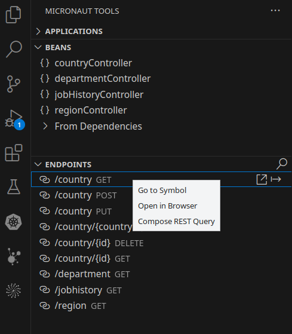
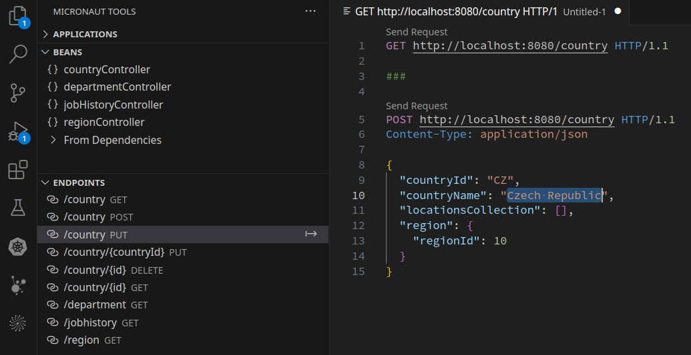
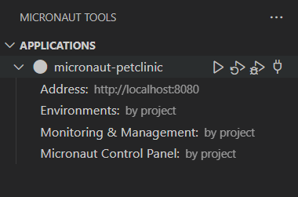
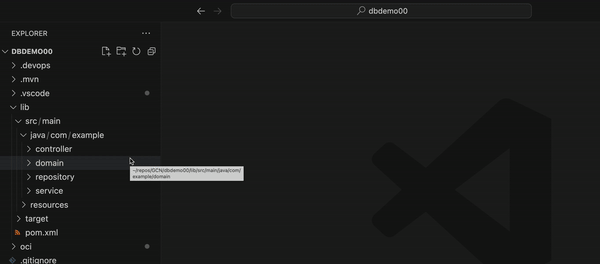
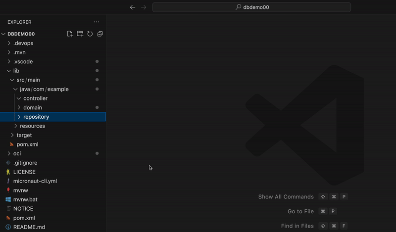
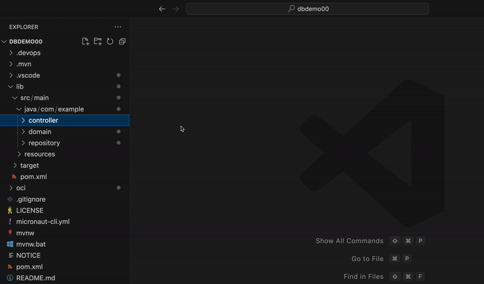

# Micronaut&reg; Tools
[](https://marketplace.visualstudio.com/items?itemName=oracle-labs-graalvm.micronaut-tools)
[](https://marketplace.visualstudio.com/items?itemName=oracle-labs-graalvm.micronaut-tools)
[](https://github.com/oracle/gcn-vscode-extensions/blob/main/LICENSE.txt)

*** Technology Preview ***

## Overview
Micronaut Tools is a powerful extension for using [GraalVM](https://www.oracle.com/java/graalvm/) to develop [Micronaut framework](https://micronaut.io/) and [Graal Cloud Native](https://graal.cloud/) (GCN) applications within VS Code.

Install the [Graal Cloud Native Extension Pack](https://marketplace.visualstudio.com/items?itemName=oracle-labs-graalvm.graal-cloud-native-pack), which contains this extension and others.

## Features
* [View Suggested Code Completions](#view-suggested-code-completions)
* [Navigate Micronaut Source Code](#navigate-micronaut-source-code)
* [View Defined Beans and Endpoints](#view-defined-beans-and-endpoints)
* [Compose REST Queries](#compose-rest-queries)
* [Editor Support for Micronaut Expression Language](#editor-support-for-micronaut-expression-language)
* [Configure and Control Your Micronaut Application](#configure-and-control-your-micronaut-application)
* [Run Your Micronaut Application](#run-your-micronaut-application) 
* [Live Reload Your Micronaut Application](#live-reload-your-micronaut-application)
* [Debug Your Micronaut Application](#debug-your-micronaut-application)
* [Connect to Your Running Micronaut Application](#connect-to-your-running-micronaut-application)
* [Monitor and Manage Your Micronaut Application](#monitor-and-manage-your-micronaut-application)
* [Observe Your Micronaut Application Using the Micronaut Control Panel](#observe-your-micronaut-application-using-the-micronaut-control-panel)
* [Package Your Micronaut Application](#package-your-micronaut-application)
* [Create a Native Executable from Your Micronaut Application](#create-a-native-executable-from-your-micronaut-application)
* [Build a Container Image and Deploy Your Micronaut Application to a Container Registry](#build-a-container-image-and-deploy-your-micronaut-application-to-a-container-registry)
* [Deploy Your Micronaut Application to Oracle Cloud Infrastructure](#deploy-your-micronaut-application-to-oracle-cloud-infrastructure)
* [Connect to an Oracle Autonomous Database](#connect-to-an-oracle-autonomous-database)
* [Create Entity Classes and Repository Interfaces from an Existing Database Schema](#create-entity-classes-and-repository-interfaces-from-an-existing-database-schema)
* [Create Micronaut Controller Classes from Micronaut Data Repositories](#create-micronaut-controller-classes-from-micronaut-data-repositories)

To request a feature or report a bug, please [contact us](#feedback).

## Requirements
- VS Code (version 1.76.0 or later).
- The [Extension Pack for Java from Microsoft](https://marketplace.visualstudio.com/items?itemName=vscjava.vscode-java-pack).
VS Code will prompt you to install the extension when you open a Micronaut project (for more information, see [Java in VS Code](https://code.visualstudio.com/docs/languages/java)).
- (Optional.) An installed Java Development Kit (JDK) (JDK 17 or later).
[Oracle GraalVM](https://www.oracle.com/java/graalvm/) is a fast and efficient JDK from Oracle.

## Installing the Extension
Click **Install** on the banner above or from the **Extensions** activity in the VS Code Activity Bar by searching for "Micronaut Tools".

You can also find the extension listed on the [VS Code Marketplace](https://marketplace.visualstudio.com/items?itemName=oracle-labs-graalvm.micronaut).

The Micronaut Tools page opens as soon as the extension is installed.
You can also open this page using the Command Palette command **Micronaut Tools: Show Micronaut Tools Page**.

> **Note**: This extension is part of the [Graal Cloud Native Extensions Pack](https://marketplace.visualstudio.com/items?itemName=oracle-labs-graalvm.graal-cloud-native-pack). We recommend you install the Graal Cloud Native Extensions Pack as it provides additional extensions for Micronaut development, including the [Micronaut Launch](https://marketplace.visualstudio.com/items?itemName=oracle-labs-graalvm.micronaut) extension.

> **Note**: This extension includes the _Apache NetBeans Language Server for Java_ to provide hints and code completion. It occasionally takes some time to start, its status is displayed in the VS Code Status Bar. 

## Usage

### View Suggested Code Completions

The extension suggests code completions for your YAML configuration files.
(The available configuration properties and their values are collected by scanning your source code and the Micronaut libraries.)

The extension also provides code completion for your Java source code via the [Extension Pack for Java from Microsoft](https://marketplace.visualstudio.com/items?itemName=vscjava.vscode-java-pack).
This gives you all the IDE features that you would expect from [IntelliSense](https://code.visualstudio.com/docs/editor/intellisense), as well as automatically highlighting errors as you type.

### Navigate Micronaut Source Code

You can easily navigate to Micronaut-specific elements of your source code via the **Go to Symbol in Workspace** command.

Run the **Go to Symbol in Workspace** command using Ctrl+T (Cmd+T on macOS) and enter the prefix:
* `@/` to show all defined request mappings
* `@+` to show all defined beans


### View Defined Beans and Endpoints
You can display all beans and request mappings defined by a Micronaut or GCN application in the **BEANS** and **ENDPOINTS** views of the Micronaut Tools activity bar.

If Monitoring and Management capabilities are enabled when the extension launches an application (or connects to an existing application), beans and endpoints available in the application are indicated with a green icon. Disabled beans are indicated with an orange icon, and their tooltips provide additional information. See [Monitor and Manage Your Micronaut Application](#monitor-and-manage-micronaut-application) for details.

You can search/filter the items in these views using a dedicated action available in the view captions or using the find shortcut (Ctrl+F or Cmd+F on macOS).

Clicking a node in one of these views navigates to the corresponding source code, similar to the **Go to Symbol in Workspace** command. You can also use the dedicated context menu action **Go to Symbol** to open the source code for the bean or request mapping.

The request mapping nodes in the **ENDPOINTS** view also provide two additional actions:
* **Open in Browser** to open the GET endpoint in a web browser.
* **Compose REST Query** to insert the corresponding query into a dedicated text document. For details, see the section _Compose REST Queries_.

Similar actions are also available in the code editor as Code Lens actions.

If an endpoint require parameters, a dialog box is provided for you to enter parameter values before calling the endpoint.



### Compose REST Queries
To easily debug and test the REST API of your application, the **ENDPOINTS** view provides smooth integration with a third-party extension [REST Client](https://marketplace.visualstudio.com/items?itemName=humao.rest-client).

To compose a REST query, invoke the **Compose REST Query** action for an endpoint either from the **ENDPOINTS** view or by using the corresponding Code Lens action in the code editor. A dedicated text document is opened, and the corresponding query is inserted. Use the REST Client features to invoke and process the query.



> **Note**: If the REST Client extension is not installed when you invoke the **Compose REST Query** action, a notification is displayed offering to quickly install it.

### Editor Support for Micronaut Expression Language
Since version 4.0, Micronaut Framework enables you to embed an evaluated expression in an annotation value using the `#{...​}` syntax. This is known as the [Micronaut Expression Language](https://docs.micronaut.io/latest/guide/#evaluatedExpressions).

The extension provides full editor support for the Micronaut Expression Language, including:
* Code completion (as shown below)
* Syntax highlighting
* Documentation hovers for Java elements and Micronaut configuration properties
* Code navigation to Java elements and Micronaut configuration properties


### Configure and Control Your Micronaut Application

You can visually configure and control your Micronaut or GCN application using the **APPLICATIONS** view of the Micronaut Tools activity. The view displays all Micronaut and GCN applications in the current workspace:



You can invoke the following actions and configure the following settings:

#### _Application_ Node (for example, "micronaut-petclinic")
Represents the logical application, and provides the following actions based on the state of your application:
* **Run Application Without Debugging**: to run your application with no debugging, see [Run Your Micronaut Application](#run-your-micronaut-application).
* **Run Application in Continuous Mode**: to run your application in continuous mode, see [Live Reload Your Application](#live-reload-your-application).
* **Start Debugging Application**: to run your application with debugging, see [Debug Your Micronaut Application](#debug-your-micronaut-application).
* **Connect to Externally Started Application**: to connect to a local or remote application that is already running, based on the `address:port` defined by the **Address** node, see [Connect to Your Running Micronaut Application](#connect-to-your-running-micronaut-application).
* **Stop Application**: to stop an application you launched.
* **Disconnect from Application**: to disconnect from an application to which you connected.
* **Open Application in Browser**: to open your application in a web browser using the `address:port` defined by the **Address** node.

#### _Subproject_ Node (GCN applications only)
Represents a subproject/module of a modular GCN application. All the settings you configure in this view are stored and used in context of this subproject. It provides the following action:
* **Change Subproject**: to switch the subproject context.

#### _Address_ Node
Defines the `address:port` to start a local application, or to connect to an application that is already running. It provides the following action:
* **Edit Application Address**: to customize the application address. To restore the default value (_http://localhost:8080_), enter an empty address.

#### _Environments_ Node
Defines the active Micronaut environment(s) for an application you launched, and provides shortcuts to the corresponding configuration files. The default `by project` value means the environments are defined by the project. A custom value forces the application to start with the defined active environments. It provides the following actions:
* **Edit Active Environments**: to define which environments will be active for the application you launch - enter an empty value to accept the default (`by project`).
* **Configure Environment Properties**: shortcuts to create new (or edit existing) configuration files for application environments.

> **Note**: For more information about Micronaut Environments, see [The Environment](https://docs.micronaut.io/latest/guide/#environments).

#### _Monitoring & Management_ Node
Enables you to configure the monitoring and management capabilities for an application you launched (for more information, see [Monitor and Manage Your Micronaut Application](#monitor-and-manage-your-micronaut-application)).
The default `by project` value means the monitoring and management capabilities are defined by the project. Change the value to `enabled` to add the required dependencies (if needed) to the project build file, and configure the required properties to enable the monitoring and management capabilities. It provides the following action:
* **Edit Monitoring & Management Availability**: to force the application to launch with the monitoring and management capabilities enabled (`enabled`). The default `by project` value means the monitoring and management capabilities will be available as configured by the project.

#### _Micronaut Control Panel_ Node
Enables you to configure the [Micronaut Control Panel](https://micronaut-projects.github.io/micronaut-control-panel/latest/guide/index.html) to view and manage the state of an application you launched (for more information, see [Observe Your Application using the Micronaut Control Panel](#observe-your-application-using-the-micronaut-control-panel)).
The default `by project` value means the Micronaut Control Panel will be available as defined by the project. Change the value to `enabled` to add the required dependencies (if needed) to the project build file, and configure the required properties to enable the Micronaut Control Panel. It provides the following actions:
* **Edit Micronaut Control Panel Availability**: to force the application to launch with the Micronaut Control Panel enabled (`enabled`). The default `by project` value means the Micronaut Control Panel will be available as configured by the project.
* **Open Micronaut Control Panel in Browser**: opens the Micronaut Control Panel in a web browser.

### Run Your Micronaut Application

The easiest way to run your Micronaut application is to view the `Application` class in the editor and click **Run** above the `main()` method, as shown here.


> **Note**: If you have defined a database connection, see [Connect to an Oracle Autonomous Database](#connect-to-an-oracle-autonomous-database), then the database connection details will be provided to your running application through an argument file when running the application in this way.

Alternatively, use the **Run Application Without Debugging** action in the **APPLICATIONS** view of the Micronaut Tools activity, or invoke **Run Without Debugging** from the **Run** menu.

### Live Reload Your Micronaut Application

Micronaut can automatically recompile and restart your application (or its parts) when it detects changes to your source code.
(This is called "Continuous Mode".)
To run your Micronaut application in this mode, view the `Application` class in the editor and click **Run with Micronaut Continuous Mode** above the `main()` method, as shown here.


Alternatively, use the **Run Application in Continuous Mode** action in the **APPLICATIONS** view of the Micronaut Tools activity.

Alternatively, select **Run and Debug** from the Activity Bar and click **Create a launch.json file**.
When prompted, select **Java** as the debugger.
A configuration labeled with "Continuous" will be created for your Micronaut application main class(es), similar to this example:


Select the newly added configuration in the **Run and Debug** view, then click **Run**.

### Debug Your Micronaut Application

The easiest way to debug your Micronaut application is to view the `Application` class in the editor and click **Debug** above the `main()` method, as shown here.


Alternatively, use the **Start Debugging Application** action in the **APPLICATIONS** view of the Micronaut Tools activity, or invoke **Start Debugging** from the **Run** menu.

### Connect to Your Running Micronaut Application

Use the **Connect to Externally Started Application** action in the **APPLICATIONS** view of the Micronaut Tools activity to observe an application. When you have connected to an application, you can:
* Monitor basic telemetry, such as CPU/memory usage
* Check active Micronaut environments
* Check available management endpoints
* Check the availability of the Micronaut Control Panel
* Check the availability and status of defined beans
* Check the availability of defined endpoints
* Change runtime configuration (such as logging levels and caches)
* Invoke management actions (such as **Refresh** and **Server Stop**)

The application must already be running on the `address:port` defined by the Address node. 
To stop observing the connected application, use the **Disconnect from Application** action.

Based on the monitoring and management capabilities or the Micronaut Control Panel availability in the connected application, various information and actions will be displayed in the Micronaut Tools activity views. See [Monitor and Manage Your Micronaut Application](#monitor-and-manage-your-micronaut-application) and [Observe Your Application using Micronaut Control Panel](#observe-your-application-using-the-micronaut-control-panel) for details.

### Monitor and Manage Your Micronaut Application
The Micronaut Tools activity views can display data and invoke actions provided by the supported [Micronaut Management & Monitoring Endpoints](https://docs.micronaut.io/latest/guide/#management).

The application must be set up and configured to provide the endpoints. This can be configured either manually (the _Monitoring & Management_ node displays `by project`), or automatically by setting the _Monitoring & Management_ node to `enabled`. This will add the required dependencies for the supported features to the project build file, and configure the launched application properties to enable the features in runtime.

> **Note**: To fully disable all enabled monitoring & management capabilities for a project, the _Monitoring & Management_ node must be set to `by project`, and the added dependencies must be manually removed from the project build file.

Based on the monitoring and management capabilities available in the launched or connected application, these information and actions will be displayed in the Micronaut Tools activity views:

#### _APPLICATIONS_ view
* **Refresh Application State action**: to destroy all refreshable beans in the context. The beans are re-instantiated upon further requests. (Requires the [Refresh endpoint](https://docs.micronaut.io/latest/guide/#refreshEndpoint).)
* **Stop Server action**: to stop an application started externally (requires the [Server Stop endpoint](https://docs.micronaut.io/latest/guide/#stopEndpoint)).
* **List of active environments**: displayed for the _Environments_ node (requires the [Environment endpoint](https://docs.micronaut.io/latest/guide/#environmentEndpoint)).
* **Actual monitoring & management capabilities availability**: displayed for the _Monitoring & Management_ node, the tooltip displays all currently available endpoints.

#### _BEANS_ and _ENDPOINTS_ Views
The beans available in a running application are indicated with a green icon; disabled beans are indicated with an orange icon; their tooltips provide additional information from the underlying framework. (Requires the [Beans endpoint](https://docs.micronaut.io/latest/guide/#beansEndpoint).)

The endpoints available in the running application are indicated with a green icon. (Requires the [Routes endpoint](https://docs.micronaut.io/latest/guide/#routesEndpoint).)

#### _MONITORING & MANAGEMENT_ view
* **_Monitoring_ node**:
  - **Uptime, CPU, Heap, Non Heap**: requires the [Metrics endpoint](https://docs.micronaut.io/latest/guide/#metricsEndpoint) with basic [Micrometer core metrics](https://micronaut-projects.github.io/micronaut-micrometer/latest/guide/) configured.
  - **Disk**: requires the [Health endpoint](https://docs.micronaut.io/latest/guide/#healthEndpoint).
* **_Management_ node**:
  - **Loggers**: displays number of configured loggers, with details in a tooltip. Use the **Configure Loggers** action to re-configure existing loggers, or create a new logger in the running process. (Requires the [Loggers endpoint](https://docs.micronaut.io/latest/guide/#loggersEndpoint).)
  - **Caches**: displays number of available caches, with details in a tooltip. Use the **Invalidate Caches** action to invalidate selected caches in the running process. (Requires the [Caches endpoint](https://docs.micronaut.io/latest/guide/#cachesEndpoint).)

### Observe Your Micronaut Application Using the Micronaut Control Panel
The **APPLICATIONS** view of the Micronaut Tools activity provides a link to the [Micronaut Control Panel](https://micronaut-projects.github.io/micronaut-control-panel/latest/guide/index.html) if your application is set up and configured to provide the Micronaut Control Panel module. 
You can configure your application either manually (the _Micronaut Control Panel_ node displays `by project`), or automatically by setting the _Micronaut Control Panel_ node to `enabled`. This will add the required dependencies to the project build file, and configure the launched application properties to enable the feature at run time.

> **Note**: To fully disable the Micronaut Control Panel for a project, set the _Micronaut Control Panel_ node to `by project`, and manually remove the added dependencies from the project build file.

If available, you can open the Micronaut Control Panel in a web browser using the **Open Micronaut Control Panel in Browser** action in the _Micronaut Control Panel_ node.

> **Note**: The Micronaut Control Panel was first introduced as an experimental feature of the Micronaut 4 framework, and may not work correctly with some other Micronaut features such as databases, caches, and so on. If your application fails to start, or works incorrectly after enabling the Micronaut Control Panel, you must manually disable the Micronaut Control Panel.

### Package Your Micronaut Application

To package your application as a runnable JAR file, follow these steps:

1. Select **Command Palette** from the **View** menu.
Enter "Micronaut Tools" and invoke the **Micronaut Tools: Build...** command.

2. Select the **compile** build goal from a list of available goals.

    

3. When the compilation is complete, invoke the **Micronaut Tools: Build...** command again.
This time, select the **package** goal, which will package your application into a JAR file.

### Create a Native Executable from Your Micronaut Application

If you have installed Oracle GraalVM, you can use GraalVM Native Image to create a native executable from your application.
GraalVM Native Image creates an executable file with all the application classes, dependent library classes, dependent JDK classes, and a snapshot of the application heap. 
The benefits include a dramatic reduction in startup time and lower overall memory consumption.

> **Note**: The time to build an executable depends on application size and complexity.

To create a native executable, follow these steps:

1. Select **Command Palette** from the **View** menu.
Enter "Micronaut Tools" and invoke the **Micronaut Tools: Build...** command.

2. Select the **compile** build goal from a list of available goals.

    

3. When the compilation is complete, invoke the **Micronaut Tools: Build...** command again.
This time, select the **nativeImage** goal, which creates a native executable from your application.

    * If your application is built with Maven, the goal runs the command `mvnw package -Dpackaging=native-image`.
    The resulting native executable will be in the _target/native-image/_ directory.

    * If your application is built with Gradle, the goal runs the command `gradlew nativeCompile`.
    The resulting native executable will be in the _build/native/nativeCompile/_ directory.

To run your Micronaut application as a native executable, open a terminal by selecting **New Terminal** from the **Terminal** menu, then run the following command: 

* If you used Maven: `./target/<executable-name>`
* If you used Gradle: `./build/native/nativeCompile/<executable-name>`

For more information, see the [Micronaut documentation](https://guides.micronaut.io/latest/micronaut-creating-first-graal-app.html).

> **Note**: If you are using VS Code on the Windows platform, invoke the **Micronaut Tools: Build Native Image** command from the Command Palette. 

### Build a Container Image and Deploy Your Micronaut Application to a Container Registry

You can build a container image of your Micronaut application, or create a container image of an executable created by GraalVM Native Image.
You can then deploy the container image.

To build and deploy a container image of your application, follow these steps:

1. Select **Command Palette** from the **View** menu.
Enter "Micronaut Tools" and invoke the **Micronaut Tools: Deploy...** command.

2. Select select one of the goals from the list:
    - To deploy a containerized Micronaut application, select the **dockerPush** goal.
    - To deploy a containerized native executable, select the **dockerPushNative** goal.

To configure your application's container registry, see the documentation for [Micronaut Maven Plugin](https://micronaut-projects.github.io/micronaut-maven-plugin/latest/)/[Micronaut Gradle Plugin](https://micronaut-projects.github.io/micronaut-gradle-plugin/latest/). 

### Deploy Your Micronaut Application to Oracle Cloud Infrastructure

**Prerequisites:**
* An Oracle Cloud Infrastructure (OCI) account.
* The [OCI DevOps Tools extension](https://marketplace.visualstudio.com/items?itemName=oracle-labs-graalvm.oci-devops) (part of the [Graal Cloud Native Extension Pack](https://marketplace.visualstudio.com/items?itemName=oracle-labs-graalvm.graal-cloud-native-pack)).

The OCI DevOps Tools extension provisions build and deployment pipelines for:
* An OCI native executable container: a containerized native executable
* An OCI Java container: a containerized Micronaut application

It can also provision a cluster to run your container on Oracle's [Container Engine for Kubernetes](https://docs.oracle.com/iaas/Content/ContEng/Concepts/contengoverview.htm).
For more information about using the OCI DevOps Tools Extension, see [Using OCI DevOps Tools Extensions in VS Code](https://www.graal.cloud/gcn/get-started/using-gcn-vscode-tools/).

### Connect to an Oracle Autonomous Database

By connecting to an Oracle Autonomous Database in VS Code, you can browse the schemas of any existing databases you may have and then quickly create a REST API that exposes them.

**Prerequisites:**
* An Oracle Cloud Infrastructure (OCI) account.

To connect to an Oracle Autonomous Database:

1. Expand the **DATABASES** view in the Explorer panel and click **Add Oracle Autonomous DB**.
If the view contains existing databases, skip to step **6**.
2. Select the compartment containing your database from the list of compartments.
3. From the list of databases, select your database.
4. Enter the username for the database.
5. Enter the password for the database.
The database will be added to the **DATABASES** view in the Explorer panel.
6. Select the database in the view, then right-click. 
Select **Connect to Database** from the menu.

To change the properties of a database connection, select the database in the **DATABASES** view, right-click and then select **Properties** from the menu.
> **Note**: Disconnect from the database before attempting to change its properties. You cannot change the properties of a _connected_ database. 

To select a database as the _Default Connection_, select the database in the **DATABASES** view, right-click and then select **Set as Default Connection** from the menu.

> **Note**: The database password is stored using an OS-specific secure storage mechanism. This will be one of the following: macOS keychain; KDE Wallet; GNOME/Keyring; Windows Data Protection API;

When running or debugging a Micronaut application from within the editor, a temporary argument file is created that contains any properties required by the application. This may include the database username and password. The contents of this file are provided to the application when it is started. This temporary file is readable only by the user running VSCode and is deleted as soon as the run/debug session finishes.

### Using OCI Vault to Store Database Connection Properties
The Micronaut Tools VS Code extension can store an application's database configuration using [OCI Vault](https://docs.oracle.com/iaas/Content/KeyManagement/Concepts/keyoverview.htm_). Vault is a service within OCI for securely managing secrets.

To make use of this feature, first create an [OCI Vault](https://docs.oracle.com/iaas/Content/KeyManagement/Tasks/managingvaults_topic-To_create_a_new_vault.htm) and [Master Encryption Key](https://docs.oracle.com/iaas/Content/KeyManagement/Tasks/managingkeys_topic-To_create_a_new_key.htm) using the Oracle Cloud Console. Please consult the OCI documentation, previously linked, on how to do this.

>If your project uses the [OCI DevOps service](https://www.oracle.com/devops/devops-service/), then make sure the [OKE Deployments Pipelines are created](https://graal.cloud/gcn/vscode-tools/oci-devops-tools/#build-and-deploy-project-artifacts) before you proceed.

To store your application database connection details using OCI Vault and for these to be made available to your application when you deploy to OKE using the OCI DevOps service, you must:

1. Connect to an Oracle Autonomous Database as described above in the *Connect to an Oracle Autonomous Database* section.
2. Ensure your Micronaut project configuration file contains the _micronaut-oraclecloud-vault_ dependency.
   * _pom.xml_
   ```
    <dependency>
     <groupId>io.micronaut.oraclecloud</groupId>
     <artifactId>micronaut-oraclecloud-vault</artifactId>
    </dependency>
    ```
   * _build.gradle_
   ```
     implementation("io.micronaut.oraclecloud:micronaut-oraclecloud-vault")
   ```
3. Right-click the database name in the Databases panel and choose **Add to OCI Vault**

   

4. From the list of compartments, select one with an existing vault. (If there is more than one vault, select the one to store your database properties.)
5. From the list of keys, select the key to encrypt your database properties. If there is only one key, this step is skipped and the default encryption key is used.
6. Provide a custom **Datasource Name**.
7. Click **Enter**. The database properties are stored in your vault. A notification is shown at the bottom of the VS Code window.
8. If the project is stored in OCI DevOps, then running the deployment pipelines from within the OCI DevOps panel will use the Database properties stored in the vault from the previous steps.

> **Note**: If OKE Deployment Pipelines are modified as described above, the OKE [ConfigMap](https://kubernetes.io/docs/concepts/configuration/configmap/) named _\<project\_name\>\_oke\_configmap_ is used. The deployment then uses the database properties stored in your OCI Vault to run a Micronaut application in OKE securely and seamlessly. Learn more about this in the [OCI DevOps Tools](https://marketplace.visualstudio.com/items?itemName=oracle-labs-graalvm.oci-devops) extension documentation.

### Create Entity Classes and Repository Interfaces from an Existing Database Schema

After you have created a connection to an Oracle Autonomous Database, you can quickly create [Micronaut Data](https://micronaut-projects.github.io/micronaut-data/latest/guide/) entity classes for the tables within the database.

**Prerequisites:**
* You have created a connection to a database with an existing schema. 
(See above.)
* You have selected the database as the _Default Connection_.
(See above.)

To create Micronaut Data entity classes:
1. Create a new Micronaut project in VS Code (or open an existing one).
2. Create a new Java package in your project, for example, `com.example.micronaut.entities`.
3. Right-click the package name and select **New From Template...** from the menu.
4. When prompted, select **Micronaut**, then **Micronaut Data Entity Classes from Database**.
5. From the list of tables, select the tables for which you want to create corresponding entities. 
6. Click **Enter**.



In a similar way, we can also create Micronaut Data repository interfaces - note this requires that you have already created entity classes (see above):
1. Create a new Micronaut project in VS Code (or open an existing one).
2. Create a new Java package in your project, for example, `com.example.micronaut.repositories`.
3. Right-click the package name and select **New From Template...** from the menu.
4. When prompted, select **Micronaut**, then **Micronaut Data Repository Interfaces from Entity**.
5. Choose if **Repository Interfaces** should be based on **CRUD** or **Pageable**. The default is **CRUD**.
6. From the list of entities, select the entities for which you want to create corresponding repository interfaces.
7. Click **Enter**.



### Create Micronaut Controller Classes from Micronaut Data Repositories

By creating Controllers that expose your Micronaut Data repository interfaces, you can quickly turn them into a REST API. Create your Micronaut Data entity and repository interfaces first and then:

1. Right-click the package name and select **New From Template...** from the menu.
2. When prompted, select **Micronaut**, then **Micronaut Controller Classes (from Data Repositories)**.
3. From the list of repositories, select one or more items. You can select all, a selection of them.
4. Click **Enter**

A controller that has access to the data repository is generated for each of the Micronaut Data repository interfaces that you selected in the wizard. By default, it contains a REST endpoint to access the repository's `findAll()` method in its `list()` method. 

Other REST Endpoints accessing a repository can be added to the controller. It is possible to add a _delete_ endpoint method, or different _find_ methods. This can be done either through **code completion** (select the desired method from the list) or directly from the editor:  **Source Action... | Generate Data Endpoint...**.

Currently, `delete()` and `get()` methods are provided; both are annotated with the Data Entity `@id` parameter. 



## Extension Settings

The extension contributes the following settings:

* __micronaut-tools.showWelcomePage__ - when set to `true` (default), show the Micronaut Tools when the extension is activated.
* __micronaut-tools.jdt.buildsystemExecution__ - if set to `true` (default), enables enhanced Run support for Micronaut applications.

## Micronaut Commands

Invoke the Micronaut commands from the Command Palette, then search for "Micronaut Tools".
To open the Command Palette, select **Command Palette** from the **View** menu.

The following commands are available for Micronaut project development:

* **Micronaut Tools: Show Micronaut Tools Page**: show the Micronaut Tools page with basic information describing this extension
* **Micronaut Tools: Build Native Executable**: build a native executable of your application using GraalVM native image
* **Micronaut Tools: Build...**: offers several the most important build tasks/targets wrapped as predefined commands for your Micronaut project
* **Micronaut Tools: Deploy...**: deploys a container to a container registry.
The container registry **MUST** be configured in the docker toolchain on the machine from which deployment is initiated.
See your docker tools documentation.
* **Micronaut Tools: Create Kubernetes Deployment Resource**: create a Kubernetes deployment resource for your application.
* **Micronaut Tools: Create Kubernetes Service Resource**: create a Kubernetes service resource for your application.
* **Micronaut Tools: Deploy to Kubernetes**: deploy to a running Kubernetes service. The service must be configured using the Kubernetes tools (`kubectl`) on the machine from which deployment is initiated.
* **Micronaut Tools: Run in Kubernetes**:  run already deployed application in Kubernetes service. This command automatically forwards the port of the container, so the application can be accessed from the browser on your local machine.
* **Micronaut Tools: Edit Target Application Address**: To customize the base URL of the running Micronaut or GCN application; the default is _http://localhost:8080_.
* **Micronaut Tools: Search/Filter Beans**: Search or filter the items in the Beans view.
* **Micronaut Tools: Search/Filter Endpoints**:  Search or filter the items in the Endpoints view.

## Troubleshooting
This extension modifies the **Java** environment so that the application is launched using the build system (Gradle, Maven). Not all environment customizations are supported and for some projects this functionality may need to be turned off.

To enable or disable the enhanced Run feature, navigate to `File - Preferences - Settings`, locate `Micronaut Tools` extension section and turn on/off the `Use build system to run or debug applications`. The relevant setting (in JSON format) is `micronaut-tools.buildsystemExecution`

In some configurations the Enhanced Run feature code lenses, `Run | Debug | Run with Micronaut Continuous Mode`, are not displayed for **Gradle** projects when **Gradle for Java extension** is enabled. 
To resolve this, disable Gradle for Java extension, reload VS Code, and then enable Gradle for Java again.

The Apache NetBeans Language Server for Java fails on Linux and macOS if the path of VSCode extensions directory contains a space, for example _/User/great code/.vscode/extensions_. (The extensions directory contains all VSCode extensions are installed.) The default path is:

* Windows _%USERPROFILE%\.vscode\extensions_
* macOS _~/.vscode/extensions_
* Linux _~/.vscode/extensions_

Change the path by removing any spaces:
* Permanently, by setting the environment variable `VSCODE_EXTENSIONS` in the appropriate profile file (for example, _.bash_profile_); or
* Temporarily by launching VSCode from the command line with the option `--extensions-dir`, for example `$ code --extensions-dir "/User/code_user/extensions_dir"`.
* It cannot be changed in VSCode Settings.

## Feedback

We would love to hear from you if you have suggestions for new features or if you have found a bug or issue. Use the links below:

* [Request a feature](https://github.com/oracle/gcn-vscode-extensions/issues/new?labels=enhancement)
* [File a bug](https://github.com/oracle/gcn-vscode-extensions/issues/new?labels=bug)

## Contributing

To submit pull requests to vscode-extensions, sign the [Oracle Contributor Agreement](http://www.oracle.com/technetwork/community/oca-486395.html).

Project members with write access to the repository will identify and assign an appropriate [Assignee](https://help.github.com/articles/assigning-issues-and-pull-requests-to-other-github-users/) for the pull request.
The assignee will work with the pull request owner to address any issues and then merge the pull request.

## Release Notes

Refer to [CHANGELOG](https://github.com/oracle/gcn-vscode-extensions/blob/main/micronaut-tools/CHANGELOG.md).

