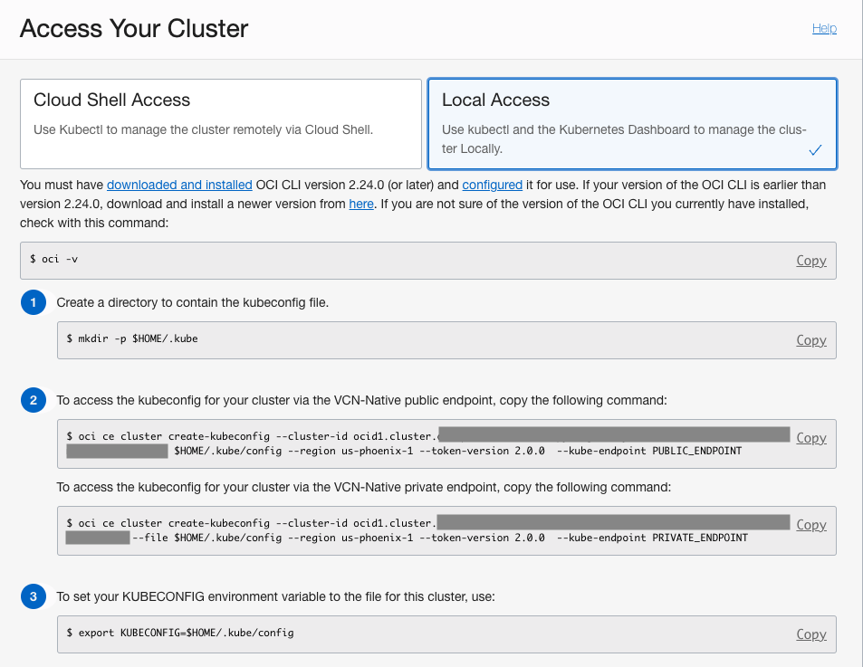
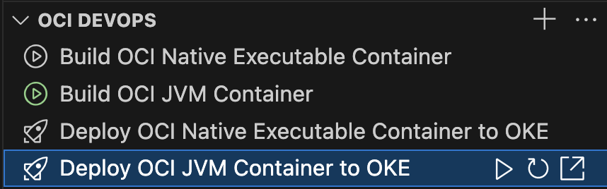

# OCI DevOps Tools

## Features

OCI DevOps Tools extension for Visual Studio Code provides features and tools to move and host a local Java project in the [Oracle Cloud Infrastructure (OCI) DevOps service](https://www.oracle.com/devops/devops-service/), and to perform cloud-side builds and deployments using the CI/CD pipelines.

* Creates and configures an OCI DevOps project from a local Java project
* Enables triggering remote build and deployment pipelines from VS Code
* Deploys the built project containers to an Oracle Kubernetes Engine (OKE)
* Performs audits for vulnerabilities in Java project's third-party libraries

For the best experience it is recommended to install the [Graal Cloud Native Extensions Pack](https://marketplace.visualstudio.com/items?itemName=oracle-labs-graalvm.graal-cloud-native-pack) which contains this extension and others.

## Supported Java Projects
* Micronaut
* Graal Cloud Native
* SpringBoot (GraalVM Native Support dependency must be enabled in project)

## Requirements
* [Extension Pack for Java](https://marketplace.visualstudio.com/items?itemName=vscjava.vscode-java-pack)
* [Kubernetes](https://marketplace.visualstudio.com/items?itemName=ms-kubernetes-tools.vscode-kubernetes-tools)
* [GraalVM](https://www.graalvm.org/) 22.x, 23.0 Java 17, or higher
* Git version control system
* A Docker-API compatible container runtime such as Rancher Desktop or Docker
​
> Note: The extension depends on the [Apache NetBeans Language Server](https://marketplace.visualstudio.com/items?itemName=ASF.apache-netbeans-java), [GraalVM Extension Pack for Java](https://marketplace.visualstudio.com/items?itemName=oracle-labs-graalvm.graalvm-pack). VS Code installs these required extensions for you.

Proxy Setup

When working behind a proxy server then VS Code Proxy has to be set ON. In VS Code **Settings** set **Http: Proxy Support** to **ON**.

Many tools used to work on Java projects, such as Git, Maven, Gradle, `kubectl`, and `docker` (if used), may require proxy configuration as well.

## Getting Started

Configure OCI and OKE

### Configure OCI
* [Create Oracle Cloud account](https://www.oracle.com/cloud/free/), free tier is supported
* [Create .oci/config](https://docs.oracle.com/en-us/iaas/Content/API/Concepts/sdkconfig.htm) cloud access configuration file
* [Install OCI CLI](https://docs.oracle.com/en-us/iaas/Content/API/Concepts/cliconcepts.htm) needed for the OKE local access

### Configure OKE
* [Create and setup local access to an OKE cluster](https://docs.oracle.com/en-us/iaas/Content/ContEng/Tasks/contengcreatingclusterusingoke_topic-Using_the_Console_to_create_a_Quick_Cluster_with_Default_Settings.htm#create-quick-cluster), Oracle's managed Kubernetes service
  * Use the Quick create option in the Create cluster wizard

  * Configure local access to the OKE Kubernetes cluster using the `VNC-Native Public Endpoint`. This is done using the Oracle Cloud Infrastructure CLI and you may have already done this in the prerequisite steps.
  
  

Create OCI DevOps Project

* Open a local folder containing a supported Java project
* In the Explorer activity, find the OCI DevOps view and click the Create OCI DevOps Project button
* Confirm pushing the local sources to a remote OCI code repository
* Choose the OCI profile to be used for OCI access if multiple profiles are defined
* Select target OCI Compartment for the project
* Select an existing OKE Cluster or create a new one.
* Provide a name for the DevOps Project to be created, must be unique within the Tenancy
* If requested, confirm the SSH keys for Git operations and add the Oracle Cloud Infrastructure DevOps Git server to your SSH _config_ and _known_hosts_ file.
* Wait for the DevOps Project and the related resources to be created.

Build and Deploy Project Artifacts

Once an OCI DevOps Project is created, the OCI DevOps view is populated by items representing remote build and deployment pipelines for each project container artifact.

To build a project container artifact, invoke the Run Build Pipeline action for the appropriate build pipeline item. The remote build pipeline is started and VS Code displays its state and build log. After a successful build, either use the Pull Container Image action to pull the resulting container artifact locally, or proceed to deploying the container to OKE.

To deploy a built container artifact, invoke the Run Deployment Pipeline action for the appropriate deployment pipeline item. The remote deployment pipeline is started and VS Code displays its state and deployment log. After a successful deployment, use the Open In Browser action to set up a port forward from OKE and open the deployed application in web browser.

Perform Vulnerability Audits

As soon as a new DevOps Project is created, an audit for vulnerabilities in third-party project libraries is automatically performed. The audit can also be invoked on demand using the VS Code **Command Palette**, **OCI DevOps: Audit Project Vulnerability** command, or from a Java Projects view using the Run Project Audit action.

Vulnerability audits can also be performed for the Maven and Gradle Java projects not added to an OCI DevOps Project. Use VS Code **Settings**, **Oci > Devops: Shared Knowledge Base Ocid** and **Oci > Devops: Shared Knowledge Base Profile** to configure the shared Knowledge Base for performing these audits.

Display Related OCI DevOps Resources

Initially only items for build and deployment pipelines related to project container artifacts are displayed in the OCI DevOps view. Additional resources can be manually added using the Add OCI DevOps Resource... action displayed in the view caption.

### Build Pipelines

These additional build pipelines are preconfigured for the Java project and can be manually added to the OCI DevOps view:
* **Build Fat Jar**: builds a single application JAR file
* **Build Native Executable**: builds a Linux x86 native executable of an application

Also externally created build pipelines can be added and controlled using this action.

### Deployment Pipelines

All preconfigured deployment pipelines are visible in the OCI DevOps view by default. Externally created build pipelines can be added and controlled using this action. Also, a new deployment pipeline can be created and added to the view, deploying a container to the OKE.

### Artifact Repository

An artifact repository configured for the DevOps Project can be added to display the non-container artifacts built for the project. These actions are available for an Artifact Repository:
* Display non-container artifacts, including build date and size
* Download built non-container artifacts locally

### Container Repository

Container repositories configured for a DevOps project can be added to display the container images built for the project. These actions are available for a Container Repository:
* Display container repository and the images, including a build date
* Pull container images locally

### Knowledge Base

A knowledge base configured for a DevOps project can be added to display the vulnerability audits performed for the project. These actions are available for a Knowledge Base:
* Display vulnerability reports, including an audit date and result
* Shortcut to a detailed online report

Open OCI DevOps Resources in Oracle Cloud Console

Whenever a DevOps resource has a dedicated view in the Oracle Cloud Console, it can be easily displayed there using the Open in Oracle Cloud Console action available for the appropriate item in the OCI DevOps view.

## Documentation

A detailed documentation on the OCI DevOps Tools extension is available [here](http://graal-cloud/gcn/vscode-tools/oci-devops-tools/).

## Settings

| Name | Description | Default Value |
|---|---|---|
| `oci.devops.showToolsPage` | Show the OCI DevOps Tools page on extension activation. | `true` |
| `oci.devops.sharedKnowledgeBaseOcid` | An OCID of the shared knowledge base for audits of Java projects, not added to an OCI DevOps project. |  |
| `oci.devops.sharedKnowledgeBaseProfile` | An OCI profile to access the shared knowledge base for audits of Java projects, not added to an OCI DevOps project. |  |
| `oci.devops.bypassDeliverArtifactsStage` | Bypass Deliver artifacts stage in Build pipelines producing Generic artifacts. | `true` |
| `oci.devops.pushLocalSourcesToOciConfirmedPermanently` | Restore confirmations before pushing local sources to a remote OCI code repository. | `false` |
| `oci.devops.startBuildPipelineUsingCustomShapeConfirmedPermanently` | Restore confirmations before starting build pipelines using a custom build runner shape. | `false` |

## Provide Feedback or Seek Help

* [Request a feature](https://github.com/graalvm/vscode-extensions/issues/new?labels=enhancement)
* [File a bug](https://github.com/graalvm/vscode-extensions/issues/new?labels=bug)

## Contributing

To submit a pull request for the OCI DevOps Tools extension, you need to sign the [Oracle Contributor Agreement](http://www.oracle.com/technetwork/community/oca-486395.html).

Project members with write access to the repository will determine and assign an appropriate [Assignee](https://help.github.com/articles/assigning-issues-and-pull-requests-to-other-github-users/) for the pull request. The assignee will work with the pull request owner to address any issues and then merge the pull request.

## Release Notes

See the [CHANGELOG](CHANGELOG.md)
